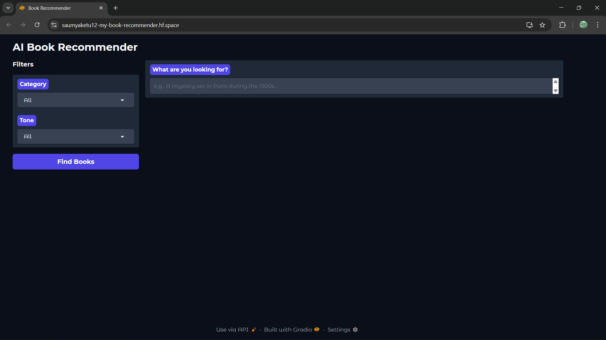
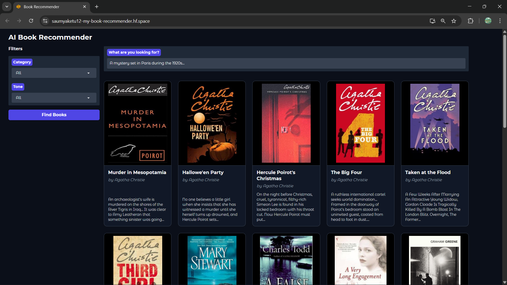
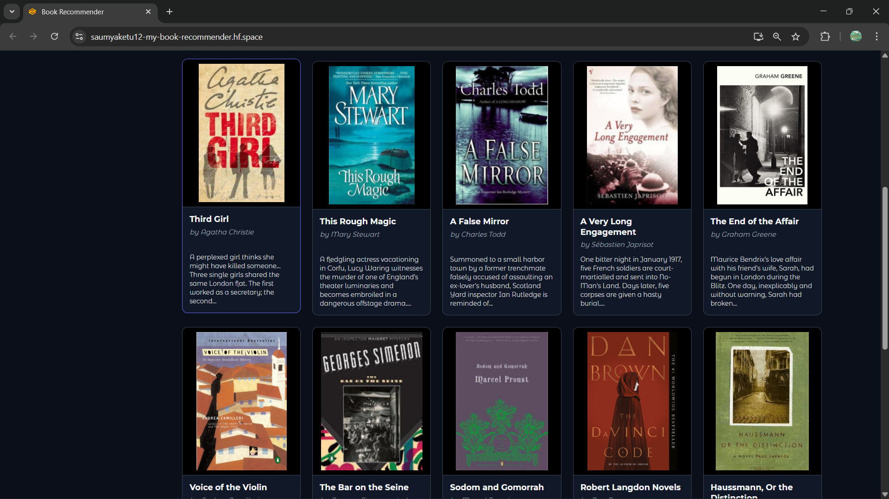
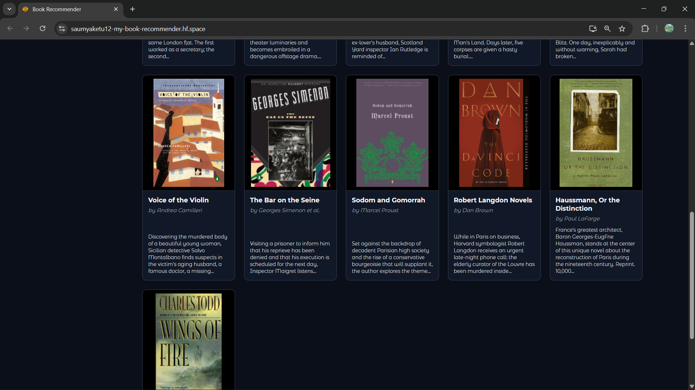
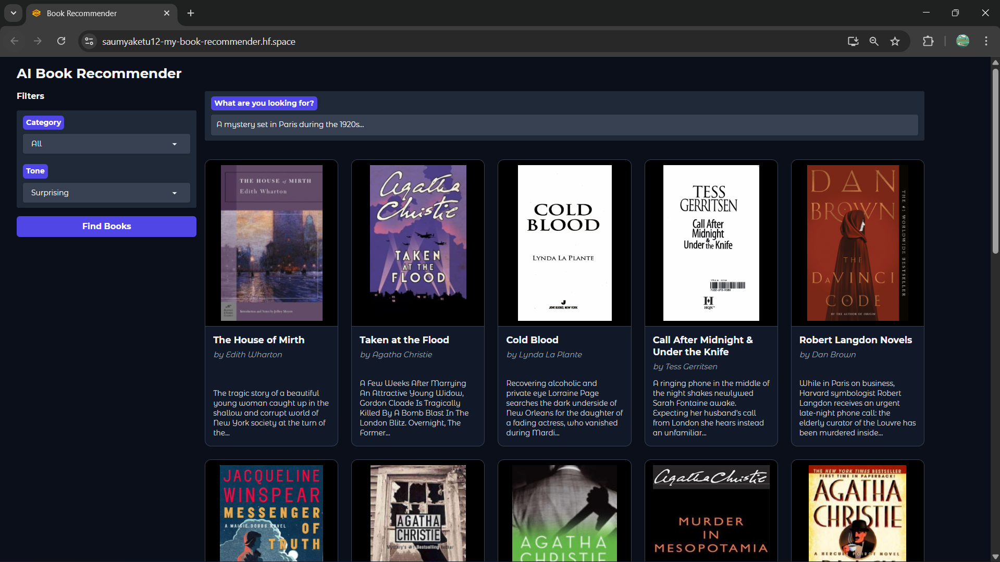
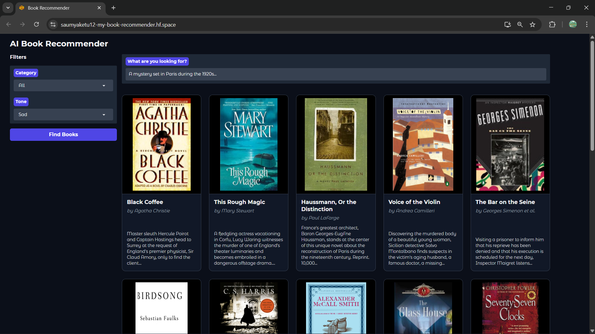

# Gemini-Powered Book Recommender

A smart, semantic book recommendation engine that uses **Google Gemini** (LLM) and vector search to find books based on natural language queries, specific categories, and emotional tone.


<h3>Dashboard</h3>



<h3>App Screenshots</h3>
<div style="display: flex; overflow-x: auto; gap: 10px; padding-bottom: 10px;">
  
  
  
  
  
</div>
<p><i>Swipe or scroll right to see more images →</i></p>

---

## Overview

This project goes beyond simple keyword matching. By leveraging **Google Gemini Embeddings**, **LangChain**, and **ChromaDB**, it allows users to describe what they want to read in plain English (e.g., *"a sci-fi mystery about time travel and lost love"*). The system understands the "meaning" behind your query and finds the best matches.

It also features a **Modern Dark UI** built with Gradio and includes **Emotion Filtering** to sort books by vibe (e.g., Happy, Suspenseful, Sad).

---

## Features

* **Semantic Search**: Powered by Google's `text-embedding-004` model. Search by description, plot, or vague ideas.
* **Modern Dark UI**: A professional, responsive card-based layout (Desktop optimized).
* **Emotion & Genre Filters**: Sort recommendations by emotional tone (Joy, Fear, Surprise, etc.) and category.
* **Smart Database Builder**: A resume-capable script (`build_db.py`) that handles API rate limits automatically.
* **Fast & Free**: designed to run on the Google Gemini Free Tier and deploy easily to Hugging Face Spaces.

---

## Tech Stack

* **Core**: Python 3.10+
* **AI/LLM**: [Google Gemini API](https://ai.google.dev/) (`langchain-google-genai`)
* **Vector Database**: [ChromaDB](https://www.trychroma.com/)
* **Orchestration**: [LangChain](https://www.langchain.com/)
* **Frontend**: [Gradio](https://gradio.app/)
* **Data**: Pandas & NumPy

---

## Installation & Setup

Follow these steps to run the project locally.

### 1. Clone the Repository
```bash
git clone https://github.com/Saumyaketu/Book-Recommender-Online.git
```

### 2. Create a Virtual Environment

```bash
python -m venv llm_env

.\llm_env\Scripts\activate
```

### 3. Install Dependencies

```bash
pip install -r requirements.txt
```

### 4. Set Up API Key

Create a file named `.env` in the root folder and add your Google Gemini API key:

```env
GOOGLE_API_KEY=AIzaSyYourActualKeyHere...
```

---

## Building the Database

Before running the app, you must build the vector database. We use a **"Smart Builder"** script that respects Google's free tier rate limits and saves progress.

```bash
python build_db.py
```

* It processes books in small batches to avoid "Quota Exceeded" errors.
* If it stops, just run it again—it will **resume exactly where it left off**.

---

## Running the App

Once the database is built (folder `chroma_db` exists), launch the web interface:

```bash
python app.py
```

Open the link provided in the terminal (usually `http://127.0.0.1:7860`).

---

## Deployment (Hugging Face Spaces)

This project is ready for free hosting on Hugging Face.

1. Create a new **Gradio Space** on Hugging Face.
2. Upload the following files/folders:
* `app.py`
* `requirements.txt`
* `data/`
* `chroma_db/`


3. Go to **Settings > Variables and secrets**.
4. Add a New Secret:
* **Name**: `GOOGLE_API_KEY`
* **Value**: (Your Gemini API Key)


5. Your app will go live in minutes!

---

## Project Structure

* `app.py`: Main application code (UI & Recommendation Logic).
* `build_db.py`: Script to generate the ChromaDB vector database (Smart Resume enabled).
* `data/`: Contains dataset files (`books.csv`, `books_with_emotions.csv`).
* `chroma_db/`: (Generated) The vector database folder.
* `requirements.txt`: Python dependencies.
* `.env`: (Ignored by Git) Stores your API key safely.

---

## Data Pipeline & Enrichment

The core of this recommender is a highly curated dataset enriched using a custom Large Language Model (LLM) pipeline. 

> **Note:** The full source code for the data generation pipeline (Data Cleaning, Zero-Shot Classification, and Sentiment Analysis) is available in our companion repository:  
>  **[Book-Recommender-LLM](https://github.com/Saumyaketu/Book-Recommender-LLM)**

The data preparation process involved:

1.  **Data Cleaning**: Raw book data was processed to remove missing values and inconsistencies.  
    *See code:* [data_exploration.ipynb](https://github.com/Saumyaketu/Book-Recommender-LLM/blob/main/data_exploration.ipynb)
    
2.  **Zero-Shot Classification**: We used a Zero-Shot Classification model to intelligently assign missing genres and standardize categories (e.g., distinguishing "Fiction" from "Nonfiction").  
    *See code:* [text_classification.ipynb](https://github.com/Saumyaketu/Book-Recommender-LLM/blob/main/text_classification.ipynb)

3.  **Sentiment Analysis**: Every book description was analyzed using the `j-hartmann/emotion-english-distilroberta-base` model. This generated an emotional profile for each book (Joy, Sadness, Fear, Anger, Surprise), allowing users to filter by "Tone".  
    *See code:* [sentiment_analysis.ipynb](https://github.com/Saumyaketu/Book-Recommender-LLM/blob/main/sentiment_analysis.ipynb)

The final enriched dataset (`books_with_emotions.csv`) allows this application to serve highly personalized recommendations.

---

## System Architecture

How the live application processes your search:

1. **Embedding**: Google Gemini (`text-embedding-004`) converts user queries and book descriptions into high-dimensional vectors.
2. **Retrieval**: ChromaDB performs a similarity search to find the vectors (books) mathematically closest to your query.

---

## Credits

* Original Dataset: [7k Books Dataset](https://www.kaggle.com/datasets/dylanjcastillo/7k-books-with-metadata)
* Models: Google Gemini, Hugging Face Transformers (for initial data processing).

---

## Author

**Saumyaketu Chand Gupta**  
LinkedIn: [saumyaketu](https://www.linkedin.com/in/saumyaketu/)  
GitHub: [Saumyaketu](https://github.com/Saumyaketu)
